# RacerPorter 
A Knowledge Base Inspection, Visualization &amp;
Authoring Workbench for KRSS-Based Description Logic (&amp; OWL)
Reasoners

## About

This is the source code of RacerPorter. RacerPorter (aka "Sirius") was
the default GUI to the RacerPro Description Logic & OWL reasoner.
RacerPorter allows you to connect to and manage RacerPro / Racer servers,
load knowledge bases (KBs) and OWL ontologies into them, invoke
reasoning services, browse and visualize KBs and ontologies, author
KBs, etc. At one point, we coined the term **OBIT - Ontology Browsing
and Inspection Tool.** It can also be used for authoring knowledge
bases though, but textually only, i.e., unlike tools like Protégé, its
focus is not on visual ontology authoring, but on textual KB /
ontology authoring, using concise, human readable & human "typable"
syntaxes (e.g., the LISP-based KRSS syntax). RacerPorter addresses the
KB & ontology expert, not the novice, casual, or "end user".

Even though RacerPorter was primarily developed for Racer / RacerPro,
and hence contains much custom Racer functionality, it can
nevertheless be customized for other KRSS-compliant DL reasoners
easily as well, simply by stripping it down and removing
Racer-specific functionality, e.g.,
[MiDeLoRa](https://github.com/lambdamikel/MiDeLoRa).

RacerPorter was last successfully tested with LispWorks 6.1 & CAPI on
Windows 10, 64bit, in March 2021. 

RacerPorter uses **LispWorks CAPI - The Common Application Programming
Interface (CAPI)** to implement a platform-agnostic GUI; it should run
out of the box on Linux, Mac, and Windows. Check out [the LispWorks
CAPI pages](http://www.lispworks.com/products/capi.html) for more
details about this great cross-platform GUI toolkit.  RacerPorter is
probably one of the biggest CAPI applications ever written. For
RacerPorter, there is no way around using CAPI - this will only work 
with LispWorks. Getting it to run on SBCL and/or CLIM is hopeless. 

Here are a few pictures that should give an idea of its capabilities:

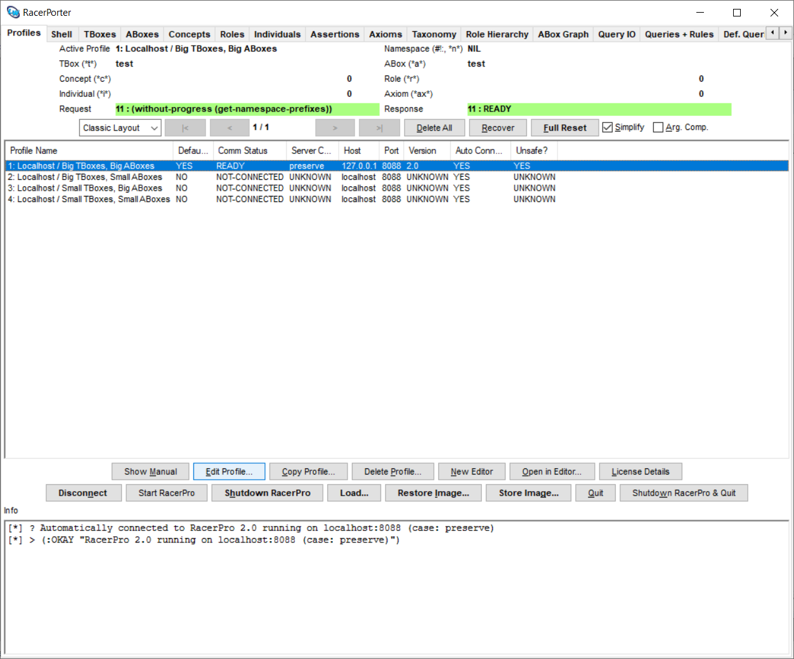

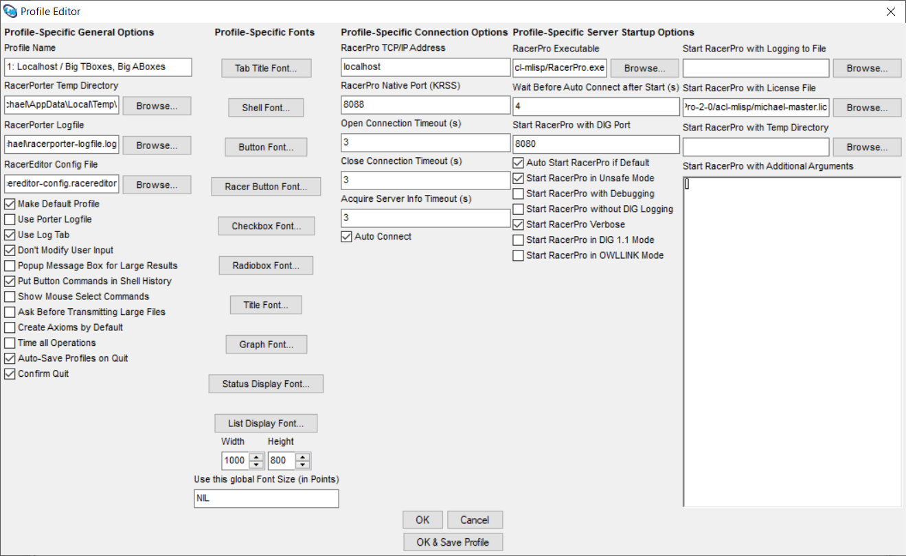

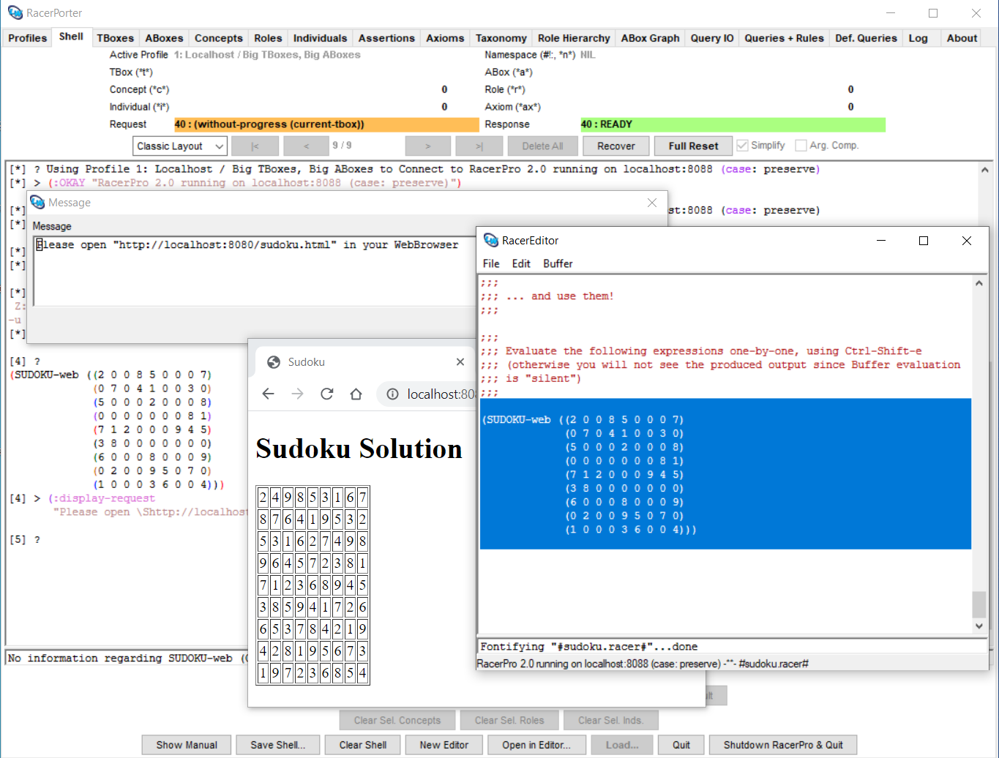

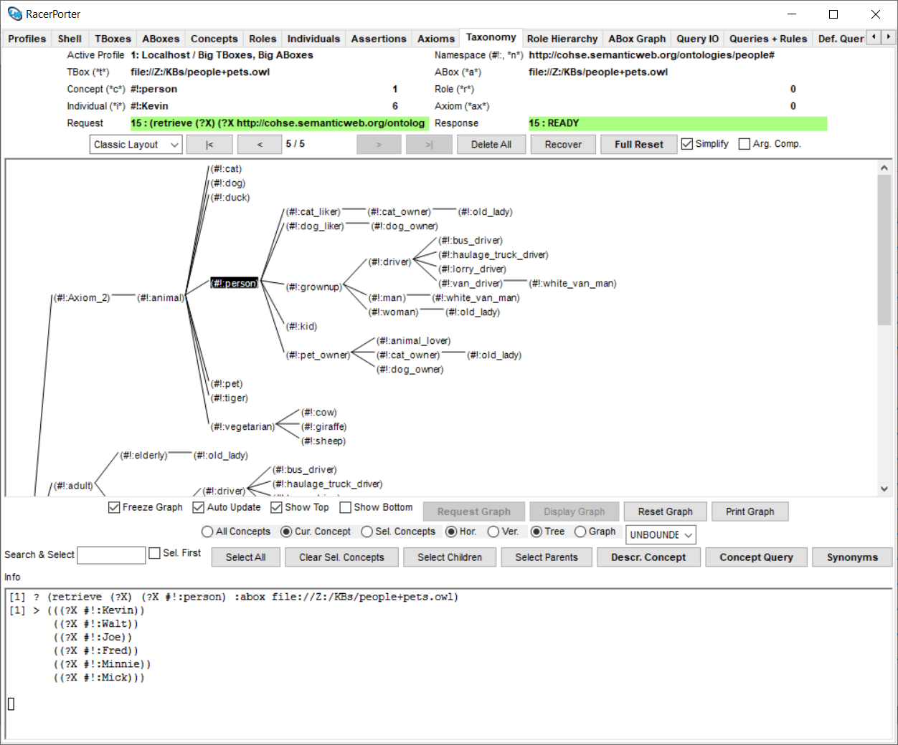

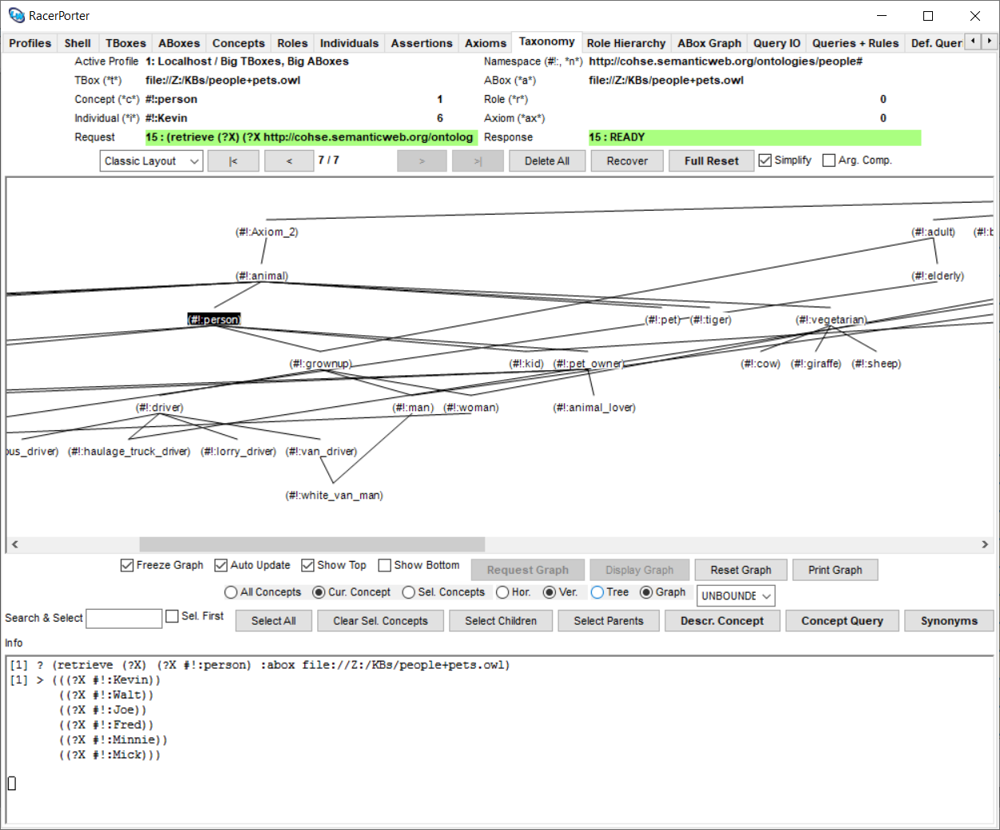

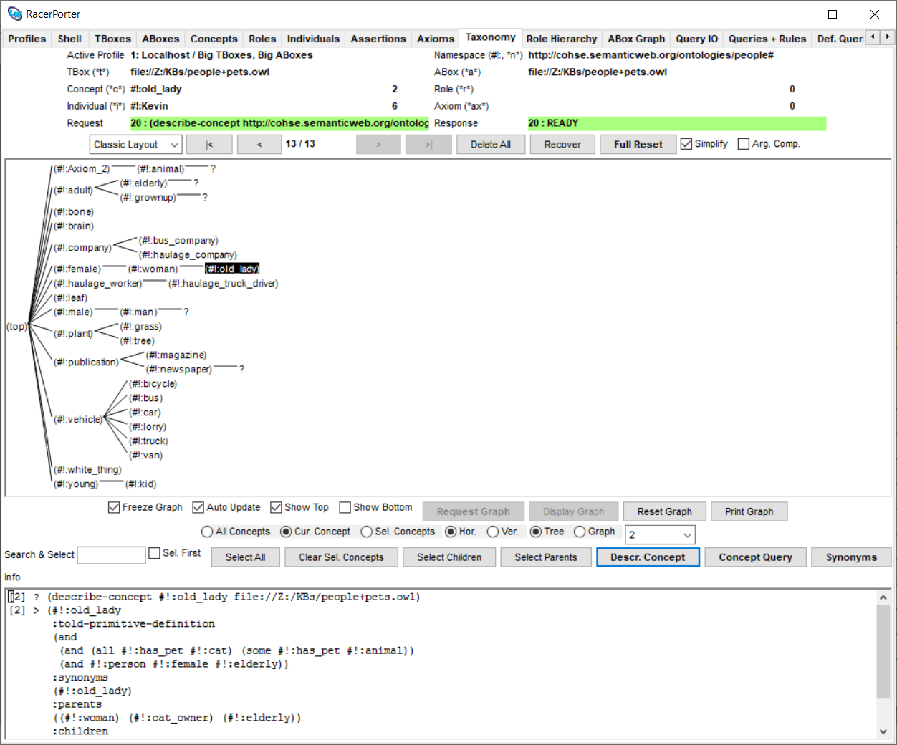

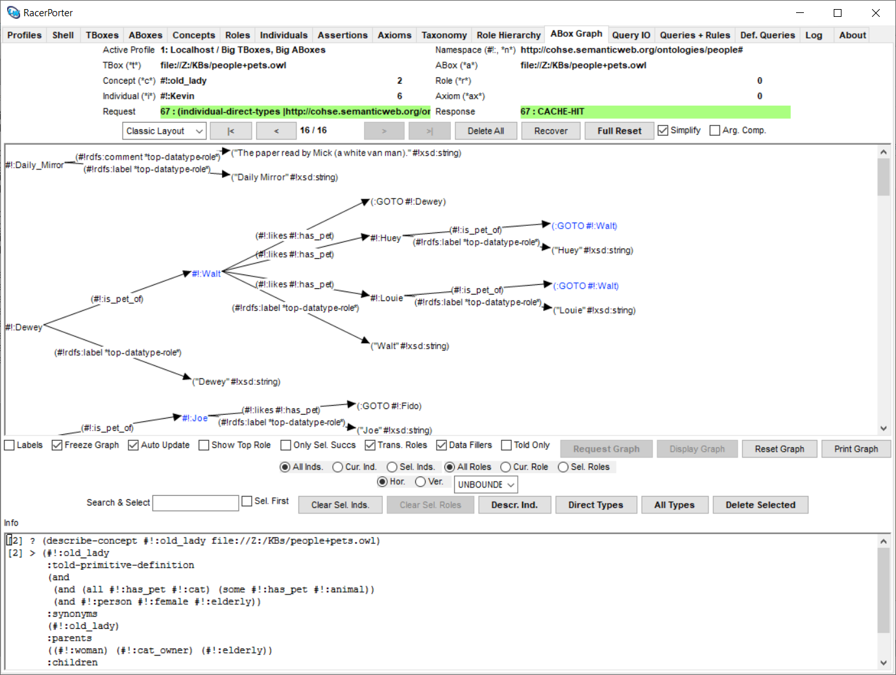

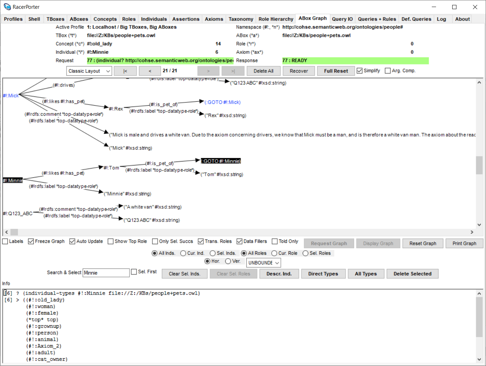

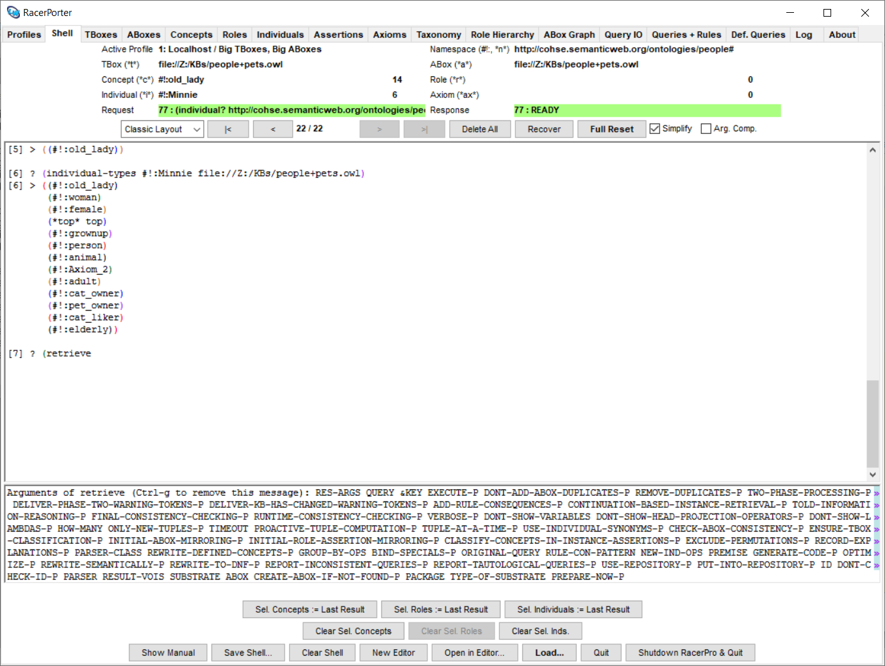

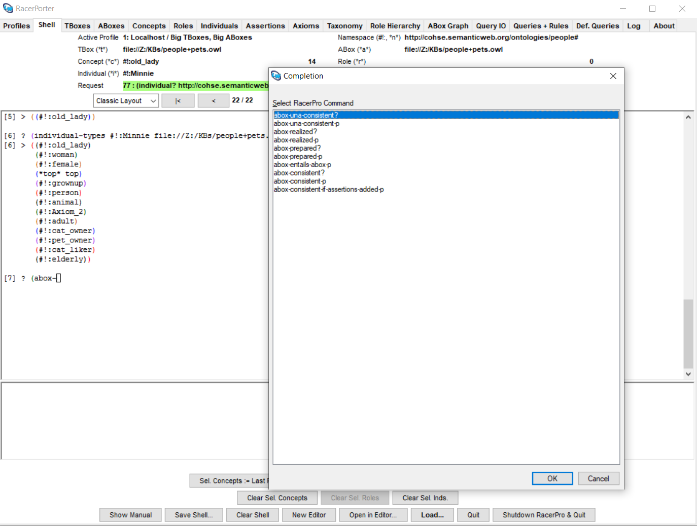

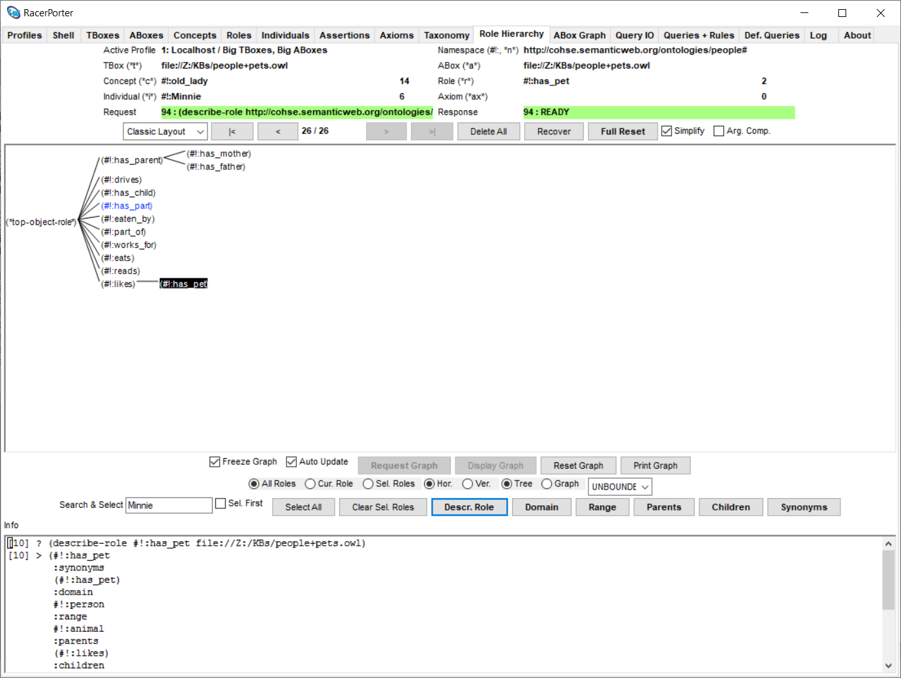

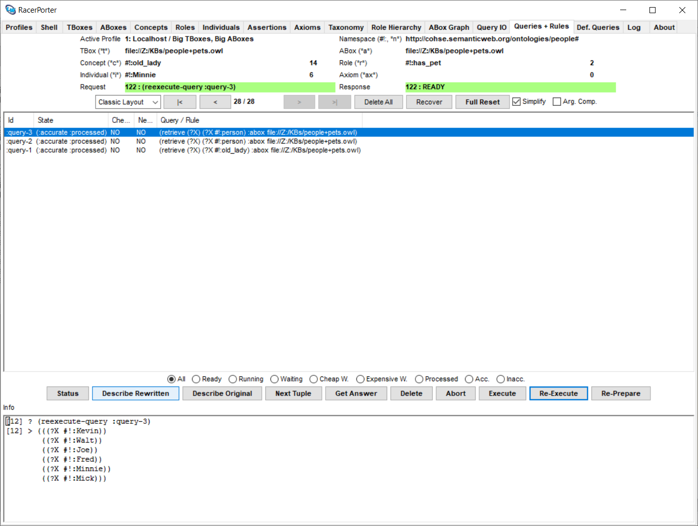

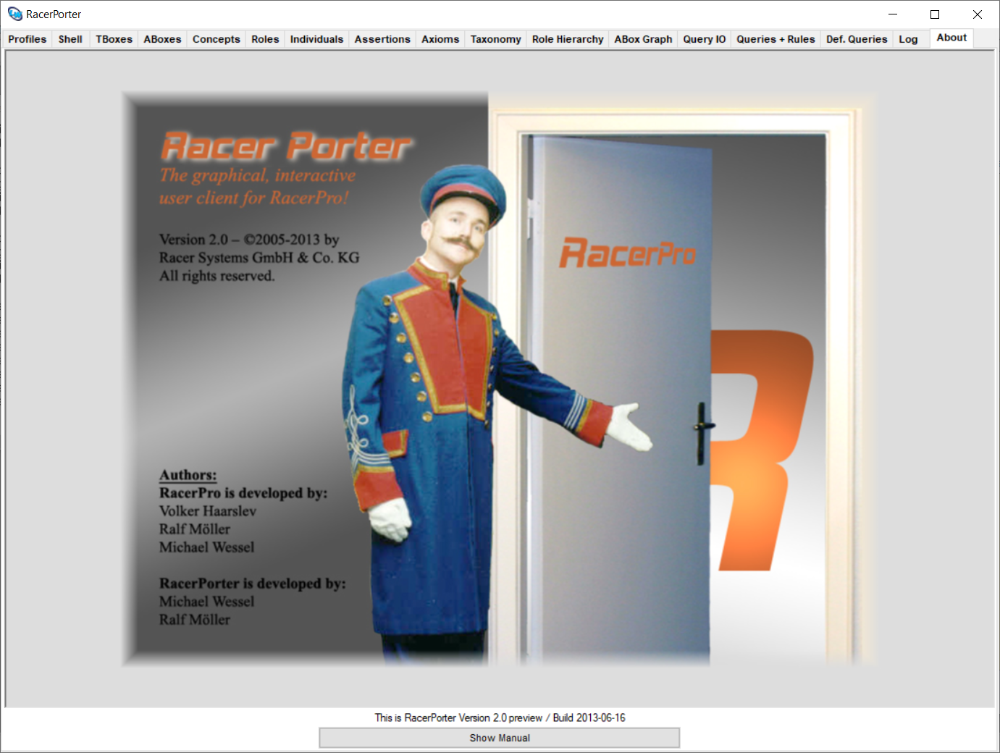

## Papers 

[See the RacerPorter paper.](./racerporter.pdf)

## Usage / Loading

Adjust the logical pathname translations in `sirius-sysdcl.lisp` to
match your environment. Then, simply do a load, and start the program
with `(racerporter-dev)` followed by `(sirius::sirius)`.

Edit the profile ("Edit Profil..." button) to automatically start a
[RacerPro executable for your OS](./racer_binaries/) (or use the
"Start RacerPro" button, followed by "Connect"). Also make sure that
the `racerlicense.lic` file gets copied into your home directory, or
the RacerPro application directory. 

Please note that this is an older version of RacerPro, which is
provided here for convenience and testing purposes only, in order to 
get RacerPorter up and running quickly.  RacerPro is now called Racer,
and is available as OpenSource.  You will find examples and the manual
on [the Racer GitHub repo](https://github.com/ha-mo-we/Racer/) as
well.
